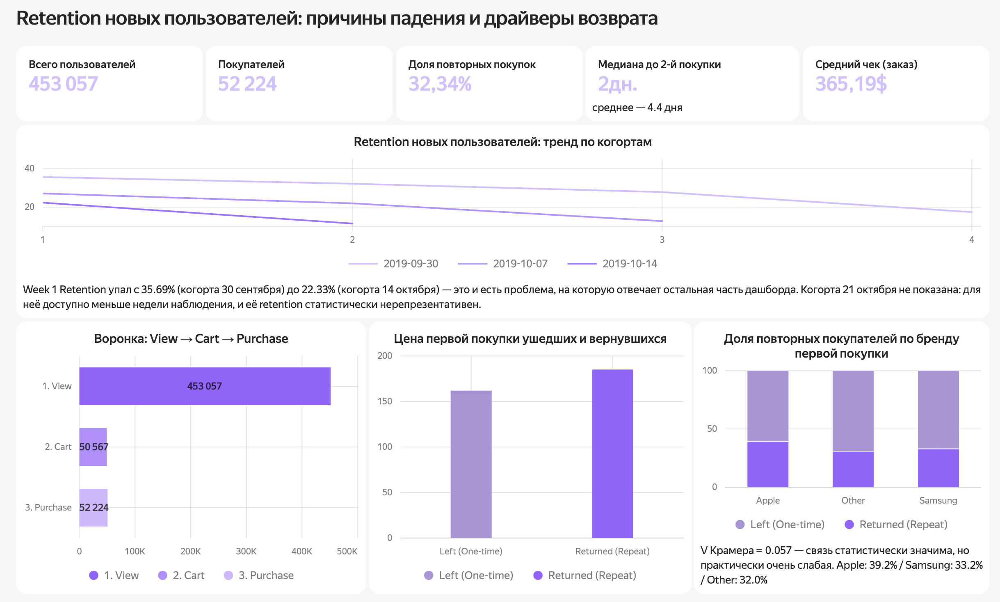

# Анализ удержания пользователей e-commerce платформы

Сквозной аналитический проект на данных интернет-магазина электроники: воронка, когортный анализ, проверка статистических гипотез и BI-дашборд. Задача — разобраться, почему падает удержание новых пользователей, и какие факторы на это реально влияют.

## Бизнес-проблема

Удержание новых пользователей внутри месяца стремительно ухудшается: Week 1 Retention падает с **35.69%** у когорты, пришедшей 30 сентября, до **22.33%** у когорты, пришедшей 14 октября.

Проект отвечает на вопрос: какие факторы — цена первой покупки, бренд первого товара, глубина просмотра каталога перед покупкой — статистически связаны с тем, вернётся ли пользователь, и что с этим делать продукту и маркетингу.

## Данные

- Источник: [REES46 Marketing Platform — eCommerce events history in electronics store](https://www.kaggle.com/datasets/mkechinov/ecommerce-events-history-in-electronics-store) (Kaggle)
- Период: октябрь 2019
- Объём: ~6.37 млн событий (`view` / `cart` / `purchase`)
- Сырой файл не загружен в репозиторий из-за размера — скачивается по ссылке выше

## Стек

Python · DuckDB (SQL-запросы напрямую к данным, без загрузки всего в RAM) · pandas · scipy.stats · matplotlib / seaborn · Yandex DataLens

## Структура репозитория

```
ecommerce-retention-analysis/
├── README.md
├── requirements.txt
├── notebooks/
│   ├── 01_problem_statement_eda.ipynb
│   ├── 02_sql_funnel_cohorts.ipynb
│   └── 03_statistical_analysis_hypothesis_testing.ipynb
└── dashboard_screenshot.png
```

### Что в каждом ноутбуке

**01_problem_statement_eda.ipynb** — загрузка данных, первичная проверка качества, постановка бизнес-проблемы, разведочный анализ объёмов событий.

**02_sql_funnel_cohorts.ipynb** — воронка View → Cart → Purchase, когортный анализ retention по неделям, расчёт честного Repeat Buyer Rate с дедупликацией по сессии (а не по строкам событий), Time-to-Second-Purchase, RFM-сегментация.

**03_statistical_analysis_hypothesis_testing.ipynb** — три гипотезы о факторах удержания, ad-hoc исследование по ночным продажам, итоговые бизнес-рекомендации, выгрузка агрегатов для дашборда.

## Ключевые находки

**Воронка:** 453 057 уникальных пользователей → 50 567 добавили товар в корзину → 52 224 совершили покупку. Покупок больше, чем добавлений в корзину — часть заказов идёт через повторные покупки и "купить сейчас" в обход корзины.

**Retention:** честный Repeat Buyer Rate (с дедупликацией по сессии, а не по количеству строк-товаров) — **32.34%**. Медиана времени до второй покупки — 2 дня (среднее — 4.4 дня).

| Гипотеза | p-value | Эффект | Вывод |
|---|---|---|---|
| Г1: цена первой покупки → возврат | 1.53e-49 | Разница медиан +14.34%, bootstrap CI [9.86%; 17.14%] | **Подтверждена.** Дорогая первая покупка повышает шанс возврата, а не отпугивает |
| Г2: глубина просмотра каталога → возврат | 1.52e-7 | медиана 7 vs 6 просмотров, эффект отсутствует | **Опровергнута практически.** Значимость — следствие большой выборки, не реальный эффект |
| Г3: бренд первой покупки → возврат | 4.49e-35 | V Крамера = 0.057 (очень слабая связь). Apple 39.2% / Samsung 33.2% / Other 32.0% | **Опровергнута частично.** Связь есть, но объясняет мизерную долю удержания |
| Ad-hoc: чек ночью vs днём | 1.31e-15 | $173.54 vs $182.41 (−4.86%) | **Опровергнута.** Ночная аудитория почти не отличается по платежеспособности |

## Бизнес-рекомендации

1. **Не занижать порог входа.** Реклама дешёвых товаров-магнитов не работает на удержание — наоборот, клиенты с дорогой первой покупкой возвращаются чаще. Бюджет на привлечение стоит смещать в сторону маржинального сегмента.
2. **Точечный, а не глобальный фокус на бренде.** Apple-покупателей можно дозревать через cross-sell аксессуаров сразу после покупки. Для сегмента "Other" — приветственные бонусы на вторую покупку с ограниченным сроком действия. Бренд — не главный рычаг лояльности, разрыв между сегментами всего ~7 п.п.
3. **Не усложнять путь до покупки.** Заставлять пользователя "гулять по каталогу" перед покупкой бессмысленно — это не влияет на retention. Фокус UX — на быстрый чекаут, а не на вовлечение через просмотры.

## Дашборд



Дашборд в Yandex DataLens: https://datalens.ru/qaj3nr990h6u9
